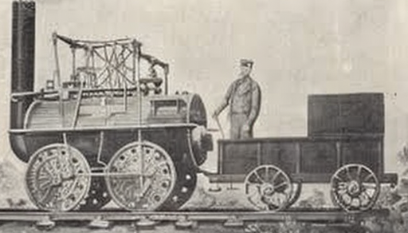
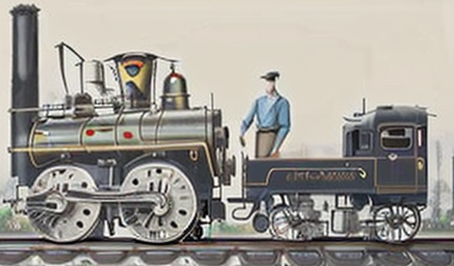

“Seeing comes before words The child looks and recognises before it can speak '' Berger's one of the simple and most thought provoking ideas of how as humans we start our life from seeing before learning to speak. As we mature, our consciousness expands alongside our ability to perceive. 
However, our senses have limits, and it is through thought that we transcend mere observation to derive meaning from visuals and images. When seeing is and always has been our means to establish ourselves to our eminent surroundings, thinking and understanding about our surroundings plays a far greater role than just seeing as through our capacity for thought and understanding that we truly interpret and respond to our surroundings. 
Our perception is shaped not only by our beliefs and knowledge but also by the insights we derive—whether consciously or unconsciously—from our experiences. When we may continuously look around and find relation between things and ourselves to present to us as we are, it is our thinking and imagining capabilities which enables this phenomena. 

“An image is a site which has been recreated or reproduced. It is an appearance or a set of appearance, which has been detached from the place and time.” While this definition remains partly valid, it overlooks images generated by computers or artificial intelligence. 
AI tools that create images, not only recreate or reproduce an image that has been detached from its time and place, but it also detaches itself from context pixel by pixel  envisioning entirely fictional scenarios.

When every image still embodies a way of seeing, the power to create that view has been substantially transferred to image generating models such as an AI trained on datasets of aesthetically pleasing individuals. 
These models are constrained to producing images conforming to predefined standards of attractiveness, limiting their capacity to depict diversity beyond these norms. Hence the power of how the image should be seen has been exponential transfers from the creator’s control to the limited computational powers of AIs. 
Though our perception or appreciation of an image does depend upon our way of seeing it probably will perhaps get affected (positively or negatively) by these similar looking generated images as they decrease the individual diversity of image quality.
| Create a portrait of a smiling young woman with long brown hair, wearing a red dress, against a neutral background. |  Create a portrait of a smiling young woman with a face that's a mix of human and animal features ,  wearing mismatched clothes, standing in front of a chaotic background. | 
|:------------------------------------------------:|:------------------------------------------------:|
|       |        |

 
 

Initially, images were a reflection of how one individual (X) perceived another (Y). However, with AI-generated images, this truth fragments into a composite of multiple perceptions (Xs) processed by computers to create an imagined portrayal (Z). This raises the question: who is the true creator—the individuals whose views were used by computers, 
the computer that processed and synthesized those views, or the entity (Z) who is envisioning the new image? Regardless of the answer, it is evident that individual authority over how an image should be perceived has significantly diminished.
 

*An image of flying birds over a corn field*
 
 
 

Berger delves into the interaction between words and images, illustrating how paintings are often accompanied by explanatory texts. He provides an example: a landscape depicting a field with birds in flight, 
later revealing it to be created by Van Gogh before his death. These words profoundly alter our perception of the image, demonstrating the transformative power of words. How words impact our perception it's hard to define, but its impact is evidently there. **Still, if one tried then will conclude that what words do is give a contextual shift or contextual positioning to an image and hence impacting its perception.** This becomes far more evident in AI generated images where one can create an image and based on individual interest change its context using words and thereby impacting the way we perceive it. 

The similar effect has been explored in the images below which are created using text prompts illustrating how they can reshape our understanding and experience of visual art.

The train:
|  An old train engine | World's first passenger train | 
|:------------------------------------------------:|:------------------------------------------------:|
|   |  |
| | |

This example aims to explore two main ideas. Firstly, it examines how words provide context to an image. Secondly, it explores how a series of images can be employed to craft an imaginary narrative (further development of the first train),leveraging proximity and enhanced image quality. AI tools have significantly simplified these processes compared to earlier methods.

In conclusion, AI-generated images have significantly diminished the value and control artists have over their work, turning their creations into easily replicable commodities absorbed into mainstream culture. This shift has introduced a new way of creating visuals through words, 
allowing individuals to convey their perspectives, albeit sometimes diverging from their original vision. As Berger pointed out, the key issue now is who controls this visual language and for what purposes. This debate encompasses important topics such as copyright in the digital age, 
ownership of art by corporations, and policies governing public art. Thus, beyond its artistic implications, this transformation raises critical socio-political and economic questions.

Access the complete esseay here- https://www.ways-of-seeing.com/