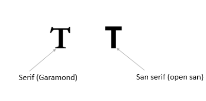
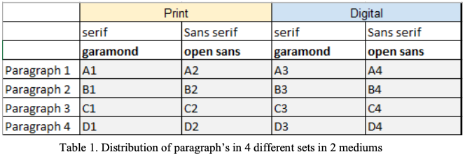
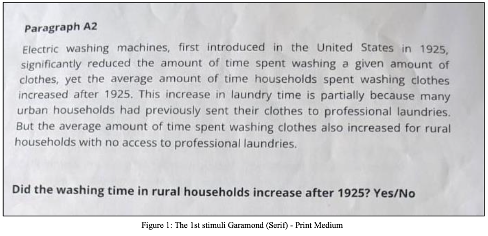
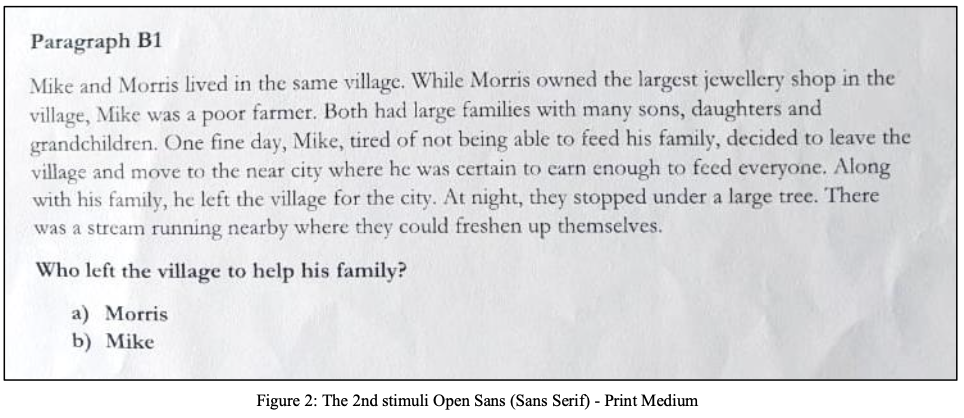
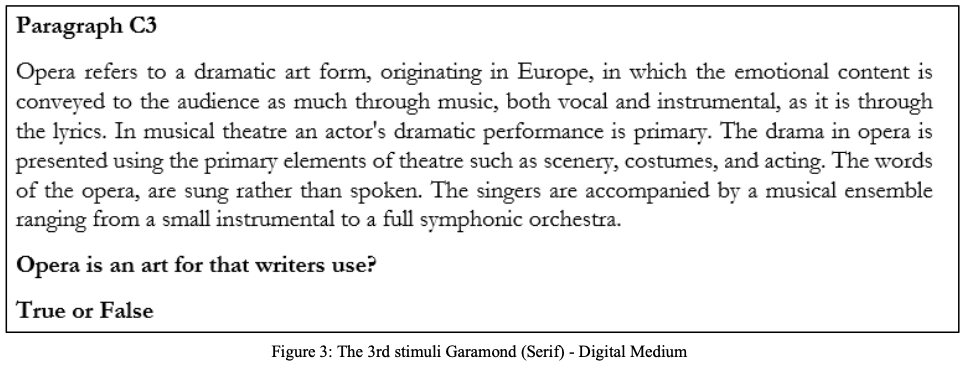
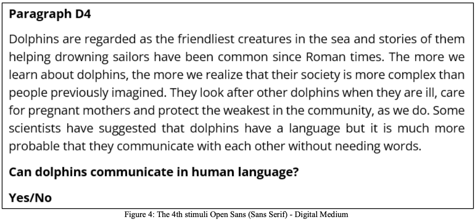
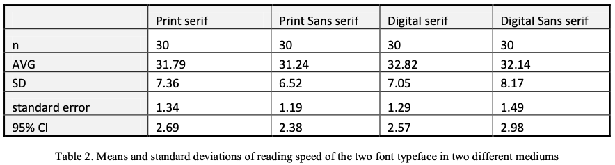
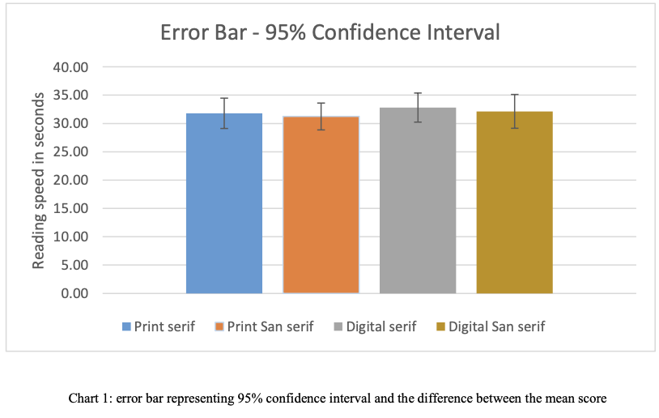
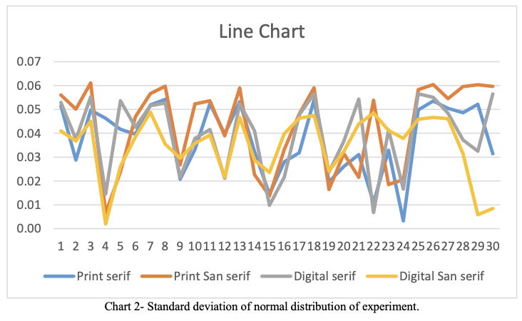

## Abstract

Several types of fonts are used in consumable media for the reader's advantage. Serif and Sans serif are two common typefaces used to distinguish fonts. The extended 'feet' in serif fonts makes it distinct. To investigate the influence of typefaces on reading speed, a speed test experiment was conducted. Random 30 samples between the age group of 18-35 were selected for the experiment and were given certain printed and digital data to read in controlled environments. The paper talks about the methodology and findings with regards to the influence of typeface on reading speed. The data collected was analyzed and placed graphically to check the influence and decide the better readable typeface.

The two fonts Garamond (Serif) and open Sans (Sans serif) were found to be equally legible in print and digital medium, as no significant statistical difference was found between the reading speed and comprehension accuracy. The results reject the null hypothesis of different font typeface can impact legibility and reading speed in print and digital mediums.

## Introduction

Throughout ages, languages have been conveyed through texts that have seen several stylizations known as typefaces [1]. Text comprises of group of alphabets and words that can be printed or displayed style or size. These texts have also been the emphasizing element that convey messages throughout different culture, which has been an essential learning tool. With the exhaustive development in information and technology and expanding use of computer interface, such as social media and online courses, people spent more time on digital media than printed media for reading. Amongst several fonts that are been used, it is important to recognize if difference in fonts can impact the reading speed and information recall. The understanding of how font's impact reading speed can help the interactive media designers to choose the typeface with the goal of ease of reading or for the information absorption or for both [2].

A Typeface distinguishes a group of characters, letters and numbers that fall under the same design style. There are two common typefaces Serif and Sans serif. The selection typeface may orient multiple factors like legibility and readability of the text in both print and digital medium. How quick a particular text is read may depend on the typeface used to write the same. Both the fonts have a visibly distinct appearance that the brain can easily recognize. There are multiple possibilities while reading typeface, e.g., does the extended feet of serif hinder the reading speed or sans serif fonts are much simplified to read faster. The previous studies have shown that reading texts with serif fonts have faster reading speeds compared to the sans- serif fonts [3]. While the other study shows that the information recall was significantly better when the participant read from the San serif fonts. A suggested hypothesis by Gasser et al. states that, “The familiarity with the type of fonts read by the participants could have played a role in their performance.”[4] Our study focuses on reading speed, while there was an attempt to consider the font size, preference, and familiarity of fonts, however the methods remotely sacrificed participants reading behavior with each font style. The results thus show that there are multiple variables that affect the reading speed, and preference of font typeface does not predict the speed even in controlled environment. The main takeaway is that several fonts work for different users, and medium of publication through print or digital does not show significant difference in reading speed.

## Background

Fonts are referred as set of text characters that consist of character spacing and design, consistently applied to uppercase and lowercase letters, including punctuation marks. Many factors can affect reading speed that include font size, blank spaces, text line spacing, paragraph style, length of the line, complexity of the sentences, character length and phonetics [5]. Readability may also include two major aspects on how well the text are been placed visually and understanding of the text. Usually in typography control of space between words plays a significant part while designing a page layout. It is said that serif fonts are suitable for printed media and San serif fonts are suitable for computer screens because they are much easier and faster to read [6]. Digital screens are different from printed media as they use resolution lower that 7 dpi, while printed documents use 180 dpi,300 dpi and higher [7].

For the experiment purpose two separate set of fonts were used. Garamond and Open Sans, formally divided into serif and sans serif fonts. Garamond belongs to the old-style serif font classification and is often used for book printing and body text, whereas Open Sans is a humanist Sans serif font designed for mobile devices. Garamond is suggested to be read faster than open sans on average [8].

#### Readability

Previously, considerable research has been done to show the effect of different typefaces and font variables on readability. Study [9] found no significant differences in reading efficiency between the font types at any size. Similar research has been done, like how high lumen letters and acuity reserve affect the readability speed [10]. A study investigated the reading speed on paper versus screen by Andrew Dillon 1992. But in theory, none of the research has yet touched upon the correlation between font reading speed over print and digital media.

#### Font and Print Media

Print media refers to mass communication through physical printed publications like newspapers, magazines, books, etc. Fonts in printed media play a significant role in readability, legibility, typesetting, and aesthetics [11]. .Legge et al. represented how readability was affected by font size. Letter spacing is another crucial factor that determines readability [12] Even though all these font properties affect readability, for our study, we will concentrate on the reading speed of comprehension over serif (Garamond) and a sans serif font (Open Sans), irrespective of these properties over print and digital media. There has been a long assumption among typographers and printers that serif or roman typefaces are more legible than Sans serifs in terms of reading speed and comprehension rates. But this assumption has been disapproved [13] as no statistical difference was observed between reading speed, scanning speed, and comprehension.

#### Font and Digital Media

Digital media refers to the distribution of information through electronic devices like digital books/eBooks, websites, blogs, social media, etc. Eric Michael Weisenmiller (1999) [14] researched to test reading speed using four fonts, Georgia, Verdana (optimized for on-screen reading), and Times (serif), Arial (sans-serif) design for Digital output. He did not find any significant difference in reading speed or readability. Whereas in an electronic test, participants read from San- serif faster and more accurately than a serif typeface [15].Similarly, in an experiment, Nafiseh Hojjati & Balakrishnan (2014) [16] found that text readability and reading performance between serif (Times New Roman) and Sans serif (Verdana) fonts show that the difference between these is significant and claimed that "sans-serif (Verdana) font type as a better choice in display long text for on- screen display." It is also claimed that serif fonts are suitable for print media and Sans serif fonts are ideal for digital screens as they are much easier and faster to read. [6]

#### Print media and Digital media

In general, people hardly notice the font if it is serif or Sans serif unless a person is working in this field or made aware of this fact. As a result, a font designed for digital media does get printed. Vice versa, a font design for printing purposes does get used on digital platforms. As we went through the theory, a lot of comparative font research talked about the effect of different parameters on reading speed. Still, none of them answer the questions like, if there will be a difference in reading speed if exact comprehension is printed? Or if a printed text or an article, when scanned and made digital, will face any discrepancies in reading speed? Hence, this paper tries to answer these questions, which either get assumed or are left untouched.

## Purpose

Font typeface may have wider implications when designing a user interface or interactive media design. With changing preferences for different mediums of consumable data, relevant study of typeface fonts shall aid the designer to enhance and take educated decisions to ensure best suited design.

## Methodology

The experiment was designed considering two factors (1) font types- Serif vs. Sans serif and (2) mediums - digital vs. print of readability. The subjects of the study were 30 random volunteers from the 18-35 age group, who could read and write in English. The two fonts chosen for experiments were Garamond (Serif) and open Sans (Sans serif). The text chosen for the experiment were 4 different English comprehension paragraphs from beginner level English books with controlled variables of 450 characters each. To randomize and counterbalance the experiment, a simple factorial design was used with all four paragraphs published 2 times on print medium and 2 times in digital medium, each using a lattice square design with four-by- four grid for each as shown in figure below.

For example with a lattice square of 4x4 grid we could identify 24 different probable treatment numbers arranged for each user. The randomized sequences were identified for every use by counterbalancing which medium or font to read first. Every paragraph were fixed to 12 point text size both in printable and digital medium. The device used for digital medium was Ipad pro-18 to evaluate both serif and sans serif fonts and was maintained as a controlled variable throughout the experiment. The distance between subjects and the reading materials was a random variable and each participant were asked to sit in a comfortable posture for reading. Moreover a person with or without spectacles was also considered as a random variable that did not influence the test. Apparatus used to measure the reading speed was stopwatch recording seconds and milliseconds.

## Procedure

A total of 30 participants with 19 men and 11 women were tested on their speed reading time. Each participants were asked to read the text in their comfortable speed. The experiment was conducted in a randomized sequence. Every participant was given a trial test read before introducing the actual sample paragraphs to get accustomed with the reading task. A stopwatch was used to notify the participants to start and they stopped the stopwatch one after each reading task was finished. Each participant were given one comprehension question to solve in the end of each reading. The questionnaire were typeset in the same font and text sizes, Garamond (Serif) and open sans (Sans serif). Each participant were instructed to read each text in only one attempt, understand and answer the question. The time taken in seconds to finish a paragraph reading and the number of questions correctly answered were tabulated together with the vital statistics about the participants (gender, age, year of study). The blow shown figures are the paragraphs used for different users. For example the set paragraphs such as A2,B1,C3,D4 was used for first participant. Similarly every participant had different permutation for reading both serif and sans serif in print and digital medium.

## results

Data analysed was based on respondents ability to read each paragraphs and the speed of reading. Chart 2 shows the line chart participants time differences conducted throughout the experiment. The results show that average time spent on print medium for Serif font(Garamond) was 31.79 sec (SD = 7.36) and Sans Serif (Open Sans) was 31.24 sec (SD = 6.52) while the mean for digital medium 32.82 sec (SD =7.05) for serif font(Garamond) and 32.14 sec (SD =8.17) for sans serif fonts (Open Sans). Chart 1 displays error bar representing 95% confidence interval and the difference between the mean score. The level of significance used to test the statistical significance was α= 0.05. A t-test was used to find the significance difference in each medium and usage of font typeface. The difference in significance in first medium that is print medium was found to be non- significant, t(30)= 0.75, p>0.05. Also the difference in significance in second medium that is digital medium was found to be non-significant, t(30)= 0.72, p>0.05. An ANOVA f-test was used to test whether there was significant difference in the readability with regards to speed between serif and sans serif in two different print and digital medium. Considering all four variable (print serif, print sans serif, digital serif, digital sans serif) the critical value obtained was 2.68, f score= 0.25. Thus the reading speed of two font serif and sans serif in two different medium print and digital was same. Table 1 summarizes the mean score and standard deviation of text reading performances of all 4 groups of font typefaces.

## Discussion And Conclusion

The research paper aims to find the difference in reading speed between font styles serif and Sans serif. The study shows no significance change in reading speed. This could be due to difference in how the study was conducted. Moreover, the independent variables like age factor and medium of reading showed individual differences in the participants when reading the font type. Some participants could comfortably read all 4 paragraphs while few took more time to understand and read them.

The major limitation in this experiment by using stopwatch may have added an extra time in seconds during its operations, i.e., the noise calculated while recording the speed of reading time in seconds might have hindered the require results. Although using an eye tracker would have been a feasible option to for accurate data, the option of a stopwatch allowed the participants to track their progress. The performance pressure pushed few participants to compete their own speed for the next paragraph reading.

Other typographical and uncontrollable factors, for example, line spacing, participant's engagement towards reading, subject interest to be read and the quality of print or visual display units, play a bigger role in legibility than the typographical differences between serifs and Sans serifs typefaces. However, a definite conclusion may not be applicable at this point, since, the study involves two different mediums, in which the digital medium, its screens brightness and participants might have strain in eyes due to screen resolution can influence the reading performance throughout the reading test. Therefore, further study on the effects of readability between print category fonts and screen category fonts, involving the same respondent group could find the specific answers. Besides that, other variable that could also be included for future research is the impacts of screen resolution on text readability. The further research could include finding the impacts fonts and readability on different devices, those popularly used as netbook, palmtop laptop, tablet pc, kindle, etc.

## Reference

[1] SVANHOLM, F., 2022. Fonts and their correlation to reading speed and information recall. STOCKHOLM, SVERIGE 2021, 15 HP, p.17.

[2] Multi-Content GAN for Few-Shot Font Style Transfer GAN for Few-Shot Font Style Transfer Samaneh Azadi1, Matthew Fisher 2, Vladimir Kim , Zhaowen Wang 2, Eli Shechtman , Trevor Darrell1 - [PDF Document]. vdocuments.net, 2022. https://vdocuments.net/multi-content-gan-for-few-shot-font-style-transfer-gan-for-few-shot-font-style-transfer.html.

[3] Hojjati, N. and Muniandy, B. The Effects of Font Type and Spacing of Text for Online Readability and Performance. Contemporary Educational Technology 5, 2 (2014).

[4] The Influence of Font Type on Information Recall. The Influence of Font Type on Information Recall North American Journal of Psychology, 7.2 (2005).

[5] Wallace, S., Bylinskii, Z. and Dobres, J. et al. Towards Individuated Reading Experiences: Different Fonts Increase Reading Speed for Different Individuals. ACM Transactions on Computer-Human Interaction 29, 4 (2022), 1-56.

[6] Typographic Design In The Digital Studio Design Concepts by Amdur .D.A. Biblio.com, 2022. https://www.biblio.com/book/typographic-design-digital- studio-design-concepts/d/1387782643.

[7] The digital typography sourcebook (1996 edition) | Open Library. Open Library, 2022. https://openlibrary.org/books/OL976070M/The_digital_typography_sourcebook.

[8] Matters, R. Towards Individuated Reading Experiences. Readability Matters, 2022. https://readabilitymatters.org/articles/towards-individuated-reading- experiences.

[9] A Comparison of Popular Online Fonts: Which Size and Type is Best?. 2002. https://www.semanticscholar.org/paper/A-Comparison-of-Popular-Online- Fonts%3A-Which-Size-is-Bernard-Lida/21a32bc134881ef07726c0e45e3d01923418f14a.

[10] Yager, D., Aquilante, K. and Plass, R. High and low luminance letters, acuity reserve, and font effects on reading speed. 2022.

[11] Relating Aesthetics of the GUI Text Elements with Readability using Font Family. Association for Computing Machinery. ACM ISBN 978-1-4503-6010- 4/18/11, (2018).

[12] Yu D, Cheung SH, Legge GE, Chung ST. Effect of letter spacing on visual span and reading speed. J Vis. 2007 Feb 1;7(2):2.1-10. doi: 10.1167/7.2.2. PMID: 18217817; PMCID: PMC2729067.

[13] LANGE, R. Performance differences between Times and Helvetica in a reading task. Academia.edu, 1998. https://www.academia.edu/en/70547287/Performance_differences_between_Times_and_Helvetica_in_a_reading_task.

[14] Weisenmiller, E. A Study of the Readability of On-Screen Type. Vtechworks.lib.vt.edu, 1999. https://vtechworks.lib.vt.edu/handle/10919/29400.

[15] Dogusoy, Berrin & Cicek, Filiz & Cagiltay, Kursat. (2016). How Serif and Sans Serif Typefaces Influence Reading on Screen: An Eye Tracking Study. 9747. 578-586. 10.1007/978-3-319-40355-7_55.

[16] Hojjati, Nafiseh & Muniandy, Balakrishnan. (2014). The Effects of Font Type and Spacing of Text for Online Readability and Performance. Contemporary Educational Technology. 5. 10.30935/cedtech/6122
