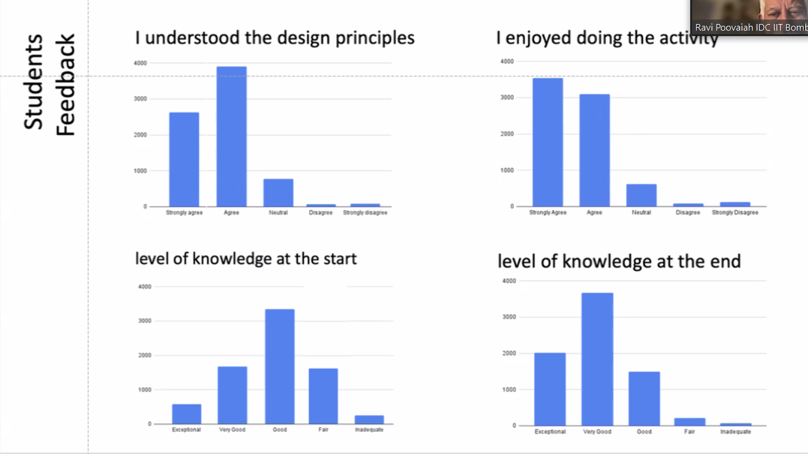

## Introduction
After India industrialized, the path towards transitioning from a developing economy to a developed one required a focus on innovation and addressing local challenges while also considering the global implications of their solutions.
This perspective led to the introduction of the new National Education Policy 2020.

## Task Books

#### Research / Understanding
The research for creating the content of the book began with the "Play and Learn Designing for Children" conference, first held in 2010 and again in 2020.
It was during this event that the realization dawned on attendees that introducing design thinking in schools could foster creativity and innovation among children.
This, they believed, was crucial for nurturing future individuals with the passion and creativity needed to address national, environmental, and economic challenges.

The conference brought together leading creatives, thinkers, designers, innovators, educators, and government officials responsible for human resource development.
It became a pivotal moment where these professionals shared insights into teaching design and creative processes, as well as their values and expectations for knowledge transfer.

From the discussions at the conference emerged a data-rich report, serving as the foundational research for the book's development.
To gain a broader understanding of potential activities, we also explored various creative initiatives implemented in schools worldwide.
Noteworthy inspirations included James Garrett's "Design and Technology" and similar publications that explored innovative educational practices.

#### Content Ideation
After gaining a comprehensive view of the topics to cover, we faced the challenge of determining the criteria for introducing activities of varying difficulty levels to students. We structured the curriculum to begin with local issues before progressing to global problems.
Initially, the activities encourage introspection before expanding to consider broader societal impacts.
Furthermore, the approach emphasizes sustainable solutions and guides students through the stages of observation, understanding, and problem-solving. Ultimately, it aims to foster participation in creative industries.
With these principles established, our next step was to explore various activities that teach design and design thinking concepts. We ensured these activities were easily comprehensible for students and that the tools and materials required were readily accessible.
An example illustrating the creation of such an activity:

[Class 10th | Module 7- Basic Prototyping Methodologies](https://docs.google.com/document/d/1PB3a3-7PlOCMdBBpGF8-yN19_9x50wZgW8M0R5Cf1_s/edit?usp=sharing)

While designing this activity, we recognized the limitations of offering a single set of activities, especially considering the prevalent coaching industry in the Indian context.
These coaching programs often provide standardized solutions for various activities. To ensure sustainability, we developed multiple alternative activities and planned for future updates as needed.
This approach not only kept the activities fresh and innovative but also allowed flexibility for customization based on contextual needs.

Additionally, we provided teachers with DOC versions of each task book, empowering them to modify activities to better suit their students' needs and enhance relatability.

#### Testing
Beyond merely writing these activities, it became crucial to test them thoroughly to gauge their effectiveness. **This involved assessing the time required to complete each activity within given timeframes, as well as evaluating students' ability to follow instructions and comprehend difficult concepts.**

We conducted comprehensive tests on nearly all activities that posed potential challenges for students, aiming to identify any hurdles in understanding or completing tasks.
These evaluations were followed by in-depth discussions to explore the learning outcomes achieved by students.
We examined the acquisition of new skills that students may not have initially possessed and assessed the quality of the output they generated.

|    |    | |
|:------------------------------------------------:|:------------------------------------------------:|:---------------------------------------------:|

#### Deployment and review
Once the books were completed, we distributed them to various workshops to gauge their reception among professionals, particularly teachers who would utilize the materials to teach these concepts.
As we are currently in the deployment phase and reviewing our work, we have received overwhelmingly positive feedback. Teachers have shown enthusiasm about integrating creativity into concepts they previously considered mundane. This feedback underscores the value of our approach and encourages us as we continue to refine and improve our materials.

---
** Available task books ** -
[Class 6th,7th,8th](https://cbseacademic.nic.in/web_material/Curriculum22/publication/middle/DT_Curriculum_workbook-6.pdf) | [Class 9th](https://cbseacademic.nic.in/web_material/Manuals/DT_Curriculum9.pdf) | [Class 10th](https://cbseacademic.nic.in/web_material/Manuals/DT_Curriculum10.pdf) | [Class 11th](https://cbseacademic.nic.in/web_material/Manuals/DT_Curriculum11.pdf) | [Class 12th](https://cbseacademic.nic.in/web_material/Manuals/DT_Curriculum12.pdf)
**Play and learn confrence report ** -
