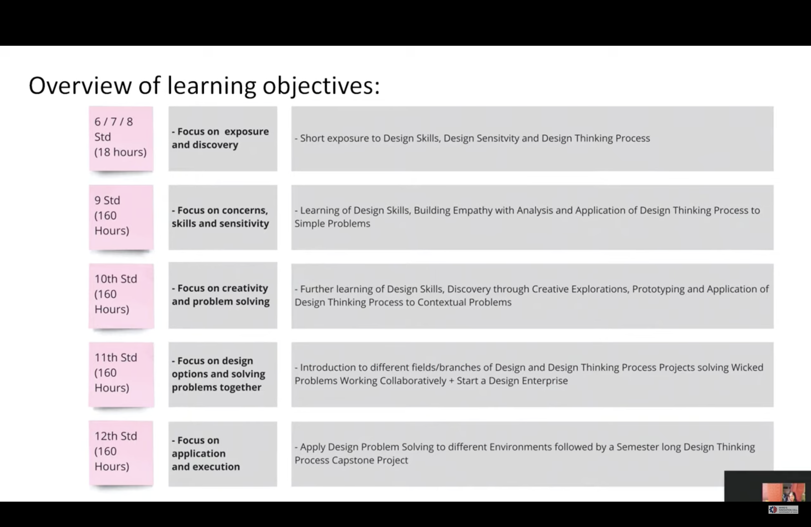

## Introduction
After India industrialized, the path towards transitioning from a developing economy to a developed one required a focus on innovation and addressing local challenges while also considering the global implications of their solutions. 
This perspective led to the introduction of the new National Education Policy 2020.

## Task Books Content 

