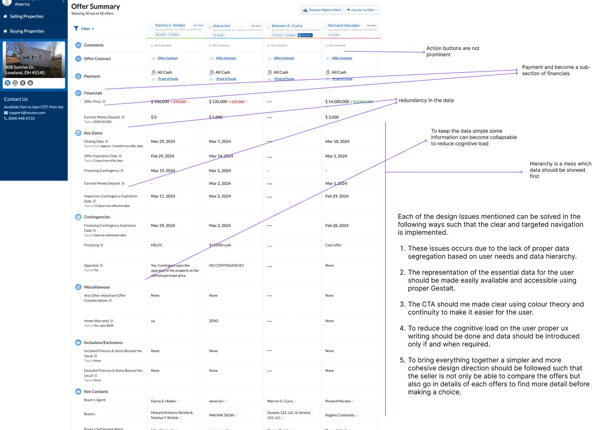
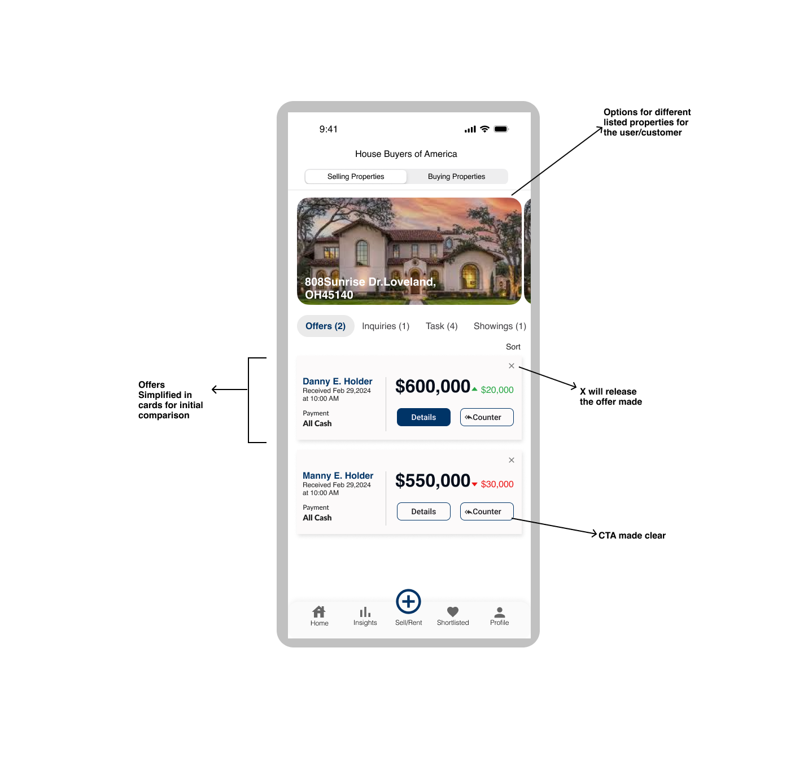
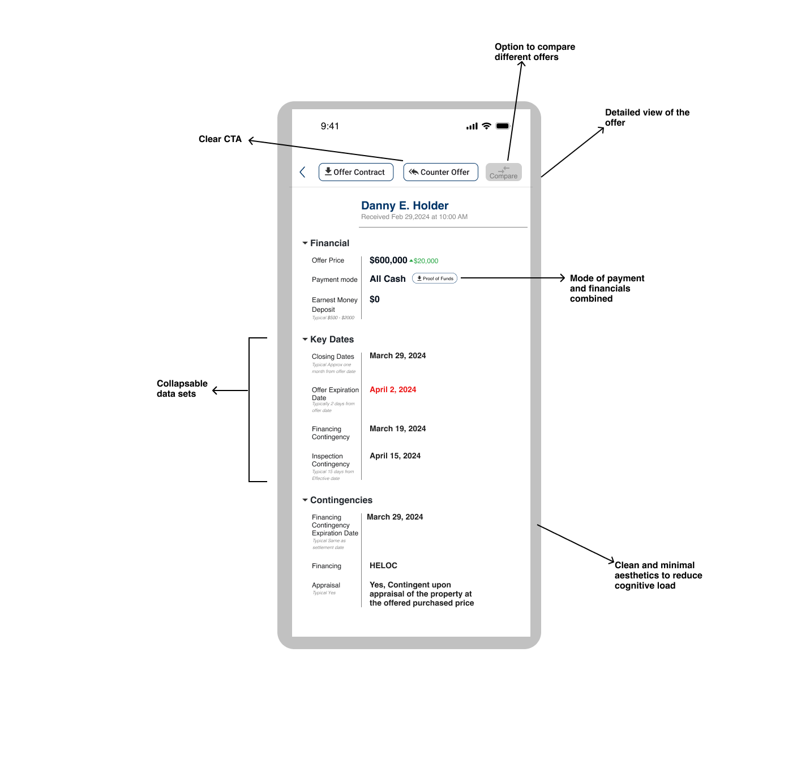
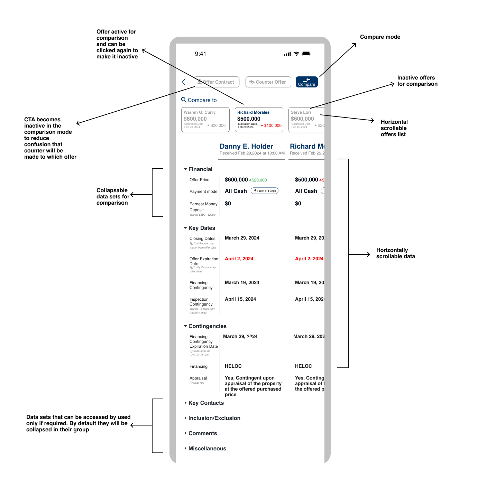

*As a designer, I delve into UX experimentes to find novel ways to accomplish critical digital tasks. 
You can find a collection these documented works that are done either as a part of freelance or as a reflective learning practice*. 

____

# Houzeo
Tech startup focused on simplifying your real estate transaction experience. Houzeo makes For Sale By Owner easy by giving you access to technologies 
only real estate agents have, including instant pricing report and closing Dashboard.

### Design Challenge Breif
Sellers  have listed their properties on the Houzeo platform, attracting  multiple offers from potential buyers or their representatives. However, sellers are facing difficulties in efficiently reviewing and comparing these offers due to the following issues:

- **Lack of Clear Differentiators**: Users struggle to discern key features and discrepancies among property offers, leading to confusion during decision-making.  
- **Poor Navigation**: Users encounter difficulties in finding relevant information due to confusing navigation structures and buried content.
- **Unclear Call to Action (CTA)**: Users need clear guidance on the next steps to take, as ambiguous or poorly positioned CTAs can hinder engagement.
- **Overwhelming Amount of Information**: Presenting users with excessive information overwhelms them, leading to decision paralysis.

 
> *Houzeo webpage UI showing offers recived by a seller and their comparision that has to be redesigned for a Mobile-app*

### Design Analysis

### UX Redesign 
Design considerations for list of offers

Design considerations for offer detail

Design considerations for offer comparison

### Prototype

<iframe width="1000" height="500" src="https://www.youtube.com/embed/a0Fdk90hCW4" title="" frameborder="0" allow="accelerometer; autoplay; clipboard-write; encrypted-media; gyroscope; picture-in-picture; web-share" referrerpolicy="strict-origin-when-cross-origin" allowfullscreen></iframe>

_______
